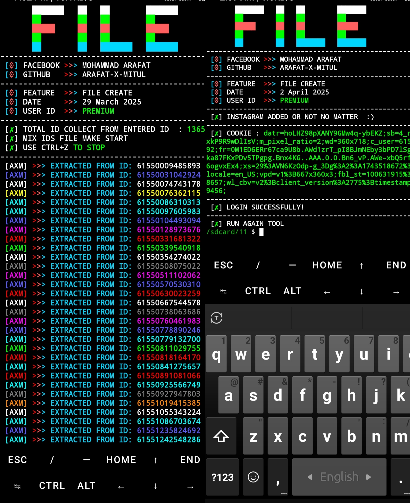

## :star2: Overview



[Note: This Tools Are Make Token Not Dump...!]

## :hammer_and_wrench: Features

- **Feature 1**: FILE MAKE
- **Feature 2**: FILE DUMP
- **Feature 3**: FILE SEPARATE
- **Feature 4**: FILE SHORTER
- **Feature 5**: FILE DEVIDER

## :rocket: Installation

```bash
rm -rf DUMP
git clone --depth=1 https://github.com/ARAFAT-X-MITUL/DUMP
cd DUMP
chmod 777 *
./DUMP
```

## :telephone_receiver: Contact Information

- **Email**: [Admin](djarfat1253444@gmail.com)
- **Facebook**: [Arafat Ahammad](https://www.facebook.com/AXM.HEREE)
- **WhatsApp**: [ARAFAT](https://wa.me/+8801766219728)
